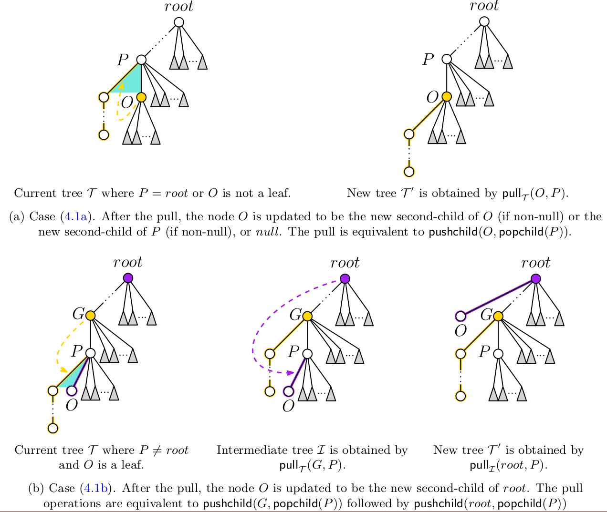

# Paul Lapey's Thesis

### Written Thesis: 

A pdf of my thesis is located at `thesis-document/thesis-git.pdf`

Alternatively, you can compile my thesis from its LaTeX source code by using `make` inside the `thesis-document` directory.  This will generate a pdf of my thesis in `thesis-document/thesis.pdf` Note: compiling LaTeX requires an installation of pdflatex.

### Ordered Trees

Source code for algorithm in chapters 4 and 5 on generating ordered trees with a fixed number of nodes is located in the `otree` directory.  Everything there is compilable with `make`; see `otree/README.md` for more information.

### Łukasiewicz Words

Source code for algorithm in chapters 7 and 8 on generating Łukasiewicz words with a fixed set of content is located in the `luka` directory.  Everything there is compilable with `make`; see `luka/README.md` for more information.

### Goals and Results

Below is an excerpt from the goals and results section of my thesis, describing the thesis's main results.

This thesis has the broad goal of extending cool-lex order to new objects. It provides two primary
contributions, each with sub-contributions.

The first contribution is a ‘pop-push’ Gray code for enumerating ordered trees in O(1) time. Chapter 4 will give a two-case successor rule for generating all ordered trees with n nodes using at most
two “pull” operations. Chapter 5 will provide a loopless algorithm for the successor rule in 4 and an
implementation of the algorithm in C. This algorithm is an extension of the cool-lex order for Dyck
words and binary trees presented by Ruskey and Williams. It shows that the cool-lex order for Dyck
words is simultaneously a Gray code for a third Catalan object: ordered trees, as well as Dyck words
and binary trees. To illustrate this result, Figure 1.3 includes a list of all ordered trees with n = 6
nodes, along with their corresponding Dyck words and the case of the successor rule that is used to
generate the next tree. Informally, the “first branching” (as highlighted) moves down one level, unless
it cannot move any lower, in which case it moves upward in two stages. The order ends when there is
no first branching. These results have been submitted to an international algorithms conference and
are currently under review [15].

The second contribution is a shift Gray code for fixed content Łukasiewicz words. Łukasiewicz words are a generalization of Dyck words that allow for broader sets of content while maintaining a notion of “balance.”
Chapter 7 will give a shift Gray code for generating Łukasiewicz words with fixed content using one
left-shift per iteration. Chapter 8 will give a loopless implementation of the algorithm in 7 using an
array based implementation for the special case of Motzkin words and a linked list implementation
for the general case of unrestricted Łukasiewicz words. These results have been accepted at the 33rd
International Workshop on Combinatorial Algorithms and will be presented June 2022 4
[14].
